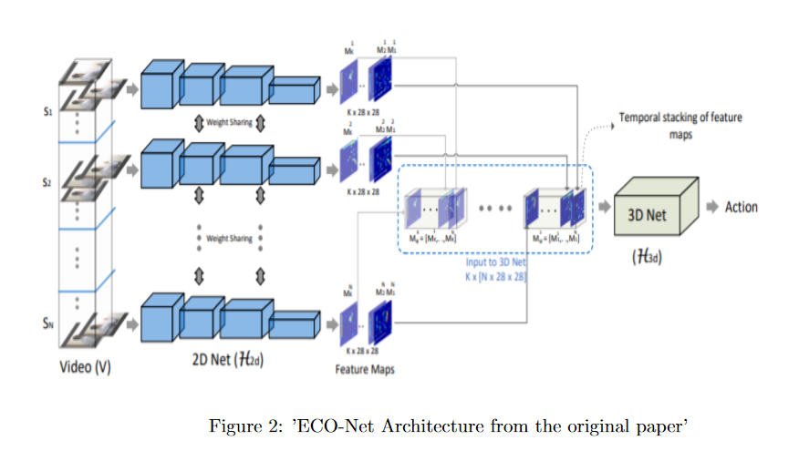

# ECO-Net-Implementation
This is an implementation of the research paper(paper review) of the paper as part of the IITM course CS6910 Fundamentals of Deep Learning<a href='https://paperswithcode.com/paper/eco-efficient-convolutional-network-for'>ECO-Net</a> loosely based on 3D Resnet as well as the specified network architecture in the model. 
<h2> Model Architecture</h2>

<h2>Training Results</h2>

<h2>Model Testing</h2>

